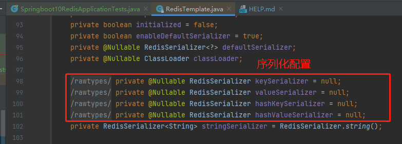
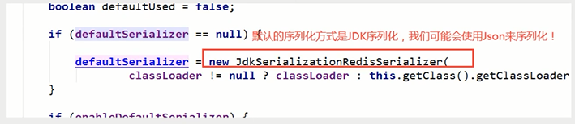

# 狂神学习（Spring-Boot）

###介绍各模块内容

* ###springboot02config：
  
  * 自动配置
* ###springboot03web：
  spring Web + maven：Thymeleaf \
  会员管理系统上的增删改查 
  * 前端：layui框架+xadmin+Thymeleaf 
  * 数据：用了MemberDao里的static数据，尚未整合到mysql数据库
  * 后端：springboot2.5.0
* ###springboot04data：
  spring Web、JDBC API、MySQL Driver + maven：Druid
  * 用RestController做了数据的增删改查，并用druid做数据监控
* ###springboot05mybatis
  spring Web、JDBC API、MySQL Driver
* ###springboot06security
* ###springboot07shrio
  * 未完成
* ###springboot08swagger
  * swagger 3.0 导入springfox-boot-starter包
  * swagger 2.+ 导入某两个包
* ###springboot09test
  * 异步任务
  * 定时任务\
    spring-boot-start-email  
    ---包含三个依赖--------------\
    \\\ jakarta.mail\
    \\\ spring-context-support\
    \\\ spring-boot-starter\
    自动配置类 --> 配置文件\
    MailSenderAutoConfiguration --> MailProperties

Cron表达式 cron="秒 分 时 日 月 星期"
详细可百度cron生成器
  * 邮件任务
* ###springboot010redis

* [Spring Web](https://docs.spring.io/spring-boot/docs/2.5.2/reference/htmlsingle/#boot-features-developing-web-applications)
* [JDBC API](https://docs.spring.io/spring-boot/docs/2.5.2/reference/htmlsingle/#boot-features-sql)
